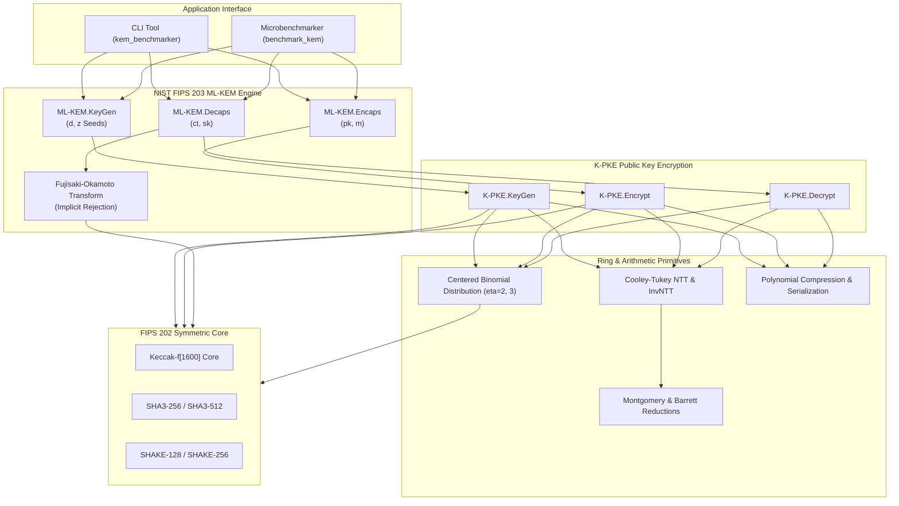

# post-quantum-kem-benchmarker

[](https://github.com/Kanak234/post-quantum-kem-benchmarker/actions/workflows/ci.yml)
[](https://github.com/Kanak234/post-quantum-kem-benchmarker/actions/workflows/codeql.yml)
[](LICENSE)
[](https://csrc.nist.gov/pubs/fips/203/final)
[](https://en.cppreference.com/w/cpp/20)
[](#quick-start)

> [!WARNING]
> **Educational & Research Notice**: This codebase is engineered strictly for educational, research, and algorithmic exploration purposes. It implements NIST FIPS 203 (ML-KEM / Kyber) in pure C++20 with zero third-party dependencies. For production deployments protecting sensitive infrastructure, rely on FIPS-validated Hardware Security Modules (HSMs) or formally audited cryptographic libraries.

An audited, high-performance, standalone C++20 implementation and benchmarking suite for the **NIST FIPS 203 Module-Lattice-Based Key-Encapsulation Mechanism (ML-KEM)**, originally standardized as CRYSTALS-Kyber.

---

## Key Features

- **Standard Compliance**: Implements the final NIST FIPS 203 specification across all three security categories:
  - **ML-KEM-512** (NIST Category 1, AES-128 equivalent security)
  - **ML-KEM-768** (NIST Category 3, AES-192 equivalent security)
  - **ML-KEM-1024** (NIST Category 5, AES-256 equivalent security)
- **Zero Dependencies**: Pure standard C++20 implementation. Self-contained FIPS 202 Keccak-f[1600], SHA3-256/512, and SHAKE-128/256 sponge primitives.
- **CCA Security & Implicit Rejection**: Constant-time Fujisaki-Okamoto transformation with pseudorandom rejection output on tampered ciphertexts.
- **Optimized Algebraic Core**:
  - Negacyclic Number Theoretic Transform (NTT) over $R_q = \mathbb{Z}_q[X] / (X^{256} + 1)$ with $q = 3329$.
  - Bit-reversed Montgomery twiddle factor representations.
  - Constant-time Montgomery reduction ($R = 2^{16}$) and 32-bit Barrett reduction.
- **Zero Dynamic Allocations**: Compile-time templated parameter engine with stack-allocated polynomials and zero runtime heap allocations.
- **Microbenchmark Suite & Interactive CLI**: Measures high-precision latency and throughput for NTT, Keccak, and KEM operations, with simulation and tamper attack demonstrations.

---

## System Architecture



---

## Measured Performance Benchmarks

*Measured locally on Linux x86_64, AMD Ryzen 7 5800H @ 3.20 GHz, Clang 21.1 / GCC 15.2, Release (-O3).*

### Primitive Operations
| Primitive Operation | Iterations | Latency (Avg) | Throughput |
| :--- | :---: | :---: | :---: |
| **Poly Forward NTT** | 20,000 | **2.23 $\mu$s** | 448,286 ops/s |
| **Poly Inverse NTT (invntt)** | 20,000 | **3.44 $\mu$s** | 291,078 ops/s |
| **SHA3-256 (1 KiB block)** | 10,000 | **8.54 $\mu$s** | 117,124 ops/s (114.4 MB/s) |

### ML-KEM Operations
| Security Level | Parameter Set | Operation | Public/Secret Key | Ciphertext | Latency (Avg) | Throughput |
| :--- | :--- | :--- | :---: | :---: | :---: | :---: |
| **Category 1** | **ML-KEM-512** | KeyGen | 800 B / 1632 B | 768 B | **97.77 $\mu$s** | 10,228 ops/s |
| | | Encaps | 800 B / 1632 B | 768 B | **80.79 $\mu$s** | 12,377 ops/s |
| | | Decaps | 800 B / 1632 B | 768 B | **63.89 $\mu$s** | 15,651 ops/s |
| **Category 3** | **ML-KEM-768** | KeyGen | 1184 B / 2400 B | 1088 B | **125.32 $\mu$s** | 7,980 ops/s |
| | | Encaps | 1184 B / 2400 B | 1088 B | **113.07 $\mu$s** | 8,844 ops/s |
| | | Decaps | 1184 B / 2400 B | 1088 B | **99.37 $\mu$s** | 10,064 ops/s |
| **Category 5** | **ML-KEM-1024** | KeyGen | 1568 B / 3168 B | 1568 B | **168.99 $\mu$s** | 5,917 ops/s |
| | | Encaps | 1568 B / 3168 B | 1568 B | **160.58 $\mu$s** | 6,227 ops/s |
| | | Decaps | 1568 B / 3168 B | 1568 B | **148.91 $\mu$s** | 6,716 ops/s |

---

## Quick Start

### Prerequisites
- C++20 compliant compiler (Clang $\ge 14$ or GCC $\ge 11$)
- CMake $\ge 3.20$
- Linux x86_64

### Build from Source
```bash
git clone https://github.com/Kanak234/post-quantum-kem-benchmarker.git
cd post-quantum-kem-benchmarker

cmake -B build -DCMAKE_BUILD_TYPE=Release
cmake --build build -j$(nproc)
```

### Run Tests
```bash
ctest --test-dir build --output-on-failure
```

### Run Interactive Demonstration
```bash
# Simulate key exchange with ML-KEM-768
./build/kem_benchmarker demo 768

# Run full microbenchmarks
./build/benchmark_kem
```

### Run with Docker
```bash
docker build -t post-quantum-kem-benchmarker .
docker run --rm post-quantum-kem-benchmarker demo 768
```

---

## Repository Structure

```
.
├── CMakeLists.txt              # CMake build configuration (C++20, -Wall -Werror)
├── Dockerfile                  # Multi-stage minimal container build
├── LICENSE                     # MIT License
├── README.md                   # Project overview & measured benchmarks
├── CHANGELOG.md                # Version release history
├── .github/
│   └── workflows/
│       └── ci.yml              # Multi-compiler matrix CI pipeline
├── benchmarks/
│   └── benchmark_kem.cpp       # High-precision microbenchmark harness
├── docs/
│   ├── PRD.md                  # Product Requirements Document
│   ├── TRD.md                  # Technical Requirements Document
│   ├── IMPLEMENTATION_PLAN.md  # Engineering milestones and task plan
│   └── EXPLAIN.md              # Deep mathematical and architectural breakdown
├── include/
│   └── kem/
│       ├── params.hpp          # FIPS 203 parameters for 512, 768, 1024
│       ├── reduce.hpp          # Montgomery & Barrett reduction API
│       ├── fips202.hpp         # Keccak-f[1600], SHA-3, and SHAKE API
│       ├── ntt.hpp             # Negacyclic NTT forward/inverse API
│       ├── poly.hpp            # Polynomial ring operations & compression
│       ├── polyvec.hpp         # Templated polynomial vectors
│       ├── cbd.hpp             # Centered Binomial Distribution sampling
│       ├── indcpa.hpp          # K-PKE encryption & decryption
│       └── ml_kem.hpp          # Top-level ML-KEM engine with FO transform
├── src/
│   ├── main.cpp                # CLI entry point
│   ├── reduce.cpp              # Modular reduction implementations
│   ├── ntt.cpp                 # NTT butterflies and twiddle factors
│   ├── poly.cpp                # Polynomial arithmetic and bit-packing
│   ├── polyvec.cpp             # Vector instantiations for K in {2, 3, 4}
│   ├── fips202.cpp             # Keccak state permutation implementation
│   ├── cbd.cpp                 # Binomial noise sampler
│   └── indcpa.cpp              # Public key encryption routines
└── tests/
    ├── test_fips202.cpp        # NIST test vectors for SHA3/SHAKE
    ├── test_reduce_ntt.cpp     # NTT roundtrip & convolution correctness
    ├── test_poly.cpp           # Serialization & compression error bounds
    └── test_mlkem_roundtrip.cpp# End-to-end KEM roundtrip & tamper rejection
```

---

## License

This project is released under the [MIT License](LICENSE).
